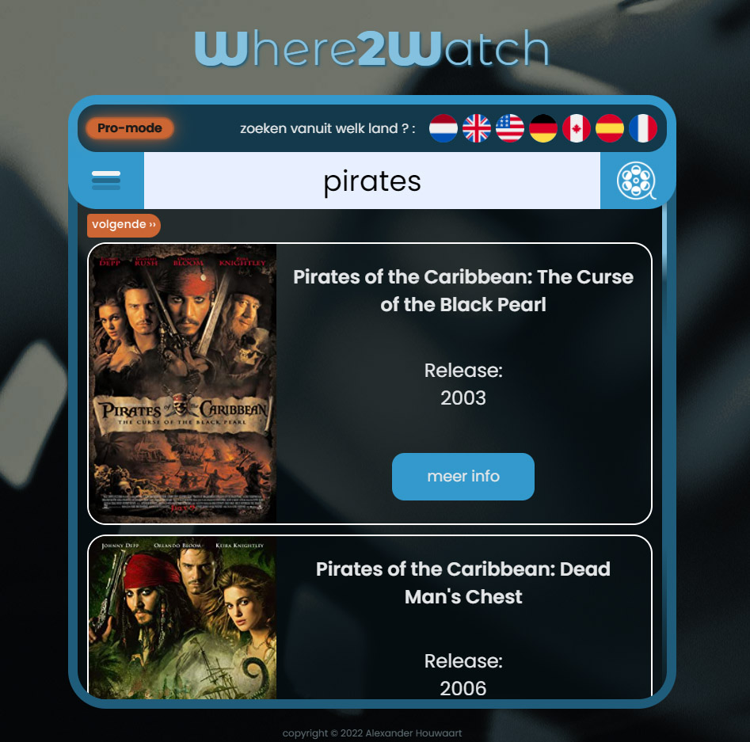

# Beschrijving van Where 2 Watch App

Deze app is gemaakt om het je makkelijk te maken om een film of serie te zoeken en vervolgens te kunnen zien op welke streamingdiensten hij te zien is.
Voor dit laatste dient de gebruiker wel in te loggen.

De app bestaat uit 3 primaire onderdelen. Te weten:
* De zoekbalk (altijd in beeld)
* het menu (alleen in beeld als de gebruiker op de menuknop klikt)
* resultaten (uiteraard alleen te zien op het moment dat een zoekactie is gestart)

## API keys

Om gebruik te kunnen maken van de verschillende mogelijkheden van de app, zijn er meerdere API's 
die met elkaar samenwerken om tot de resultaten te komen. Hiervoor zijn API-keys nodig. Deze moeten uiteraard nog wel toegevoegd worden.

Deze keys zijn allen gratis te verkrijgen op de volgende sites:

* [imdb-alternative](https://rapidapi.com/rapidapi/api/movie-database-imdb-alternative/) - dit is API_KEY1
* [imdb-official](https://imdb-api.com/Identity/Account/Register) - dit is API_KEY2

Als de keys bekend zijn kun je ze toevoegen in het `.env` bestand

> REACT_APP_API_KEY1=< hier komt KEY1 >
> 
> REACT_APP_API_KEY2=< hier komt KEY2 >
> 
> REACT_APP_API_KEY_FIREBASE= deze staat er al

Let op: hier hoeven dus geen "quotes" omheen!

Er wordt ook nog gebruik gemaakt van andere API's, echter daar zijn geen keys voor nodig.

# Opstarten van de App

## scripts te runnen alvorens te starten met de App

In de terminal run je:

### `npm install`

Dit installeerd alle benodigde dependencies, zowel React zelf als anderen. Het kan dus wel even duren,
voordat alles geïnstalleerd is. De andere dependencies zijn:
* React-router-dom -- Om routing tussen pagina's makkelijk te maken.
* React-responsive -- Wordt gebruikt om bepaalde events te triggeren naar aanleiding van een media-query.
* Axios -- Voor de afhandeling van bepaalde elementen in API calls.
* movie-quotes -- Voor het geven van een willekeurige film-quote wanneer de gebruiker is ingelogd en naar zijn account gaat.
* React-hook-form -- Voor het afhandelen van formulieren.
* Firebase -- Voor de afhandeling van de communicatie met de firebase server.

Nadat dit allemaal geïnstalleerd is kun je de App starten met het commando:

### `npm run start`

Opent de App in development mode.\
Open [http://localhost:3000](http://localhost:3000) om het te kunnen zien in je browser.\
Mocht deze 3000 poort al bezet zijn dan zal de terminal vragen om hem op de eerst volgende beschikbare poort te openen.\
Type 'y' in om te bevestigen. Meestal wordt de link dan [http://localhost:3001](http://localhost:3001) , het kan echter ook een ander nummer zijn. Let daarom op wat de terminal zegt op het moment dat voor yes word gekozen.

# Inloggen

Om in te loggen kun je natuurlijk een nieuw account aanmaken (menu => log in => nieuwe gebruiker)
of je kunt er voor kiezen om een standaard account te gebruiken (menu => log in). De gegevens hiervoor zijn:

> ###email: test@test.nl
>
> ###wachtwoord: 123456aA!

##Have Fun!!

